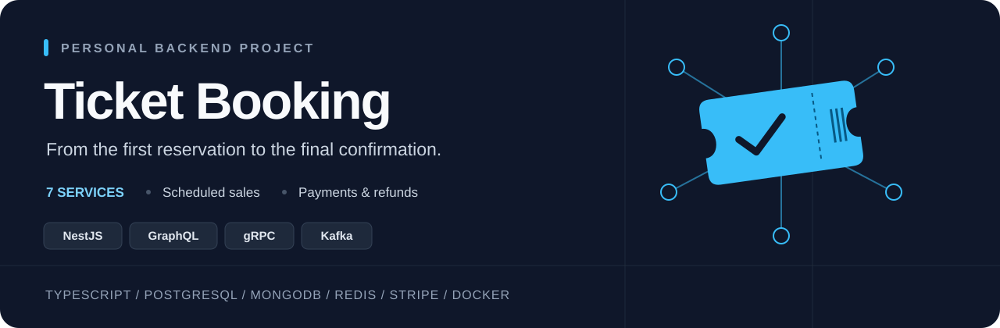
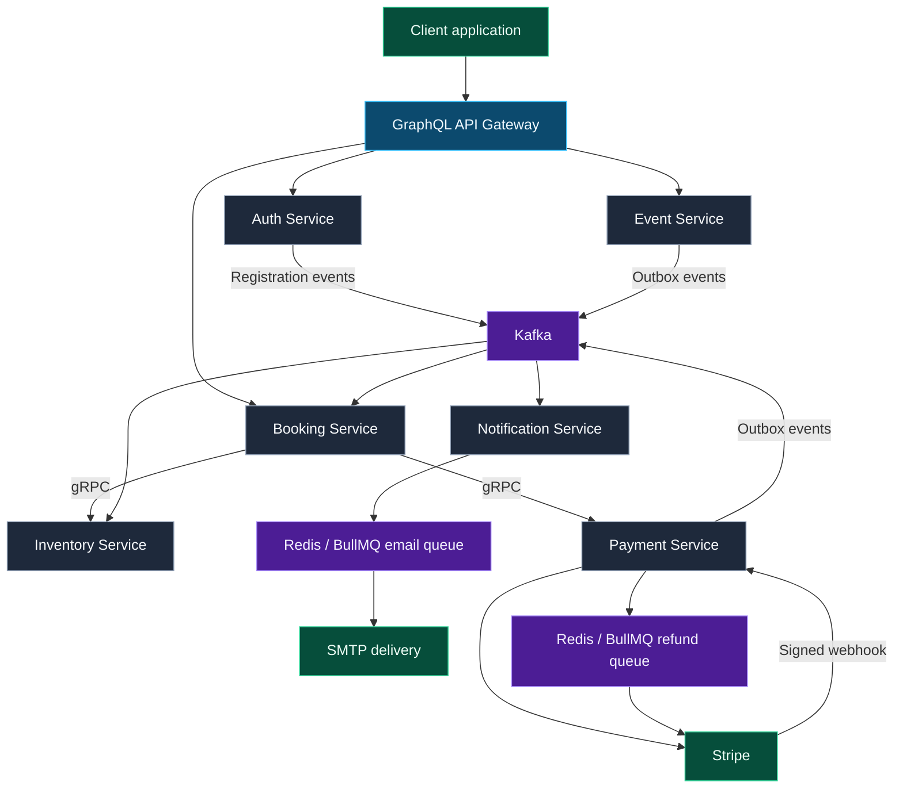

<p align="center">
  
</p>

<p align="center">
  <strong>Reserve tickets. Coordinate payments. Handle what happens next.</strong>
</p>

<p align="center">
  <a href="#-technology-stack">Tech Stack</a> ·
  <a href="#-highlights">Highlights</a> ·
  <a href="#-architecture">Architecture</a> ·
  <a href="#-running-locally">Getting Started</a>
</p>

# 🎟️ Ticket Booking

A personal backend project for event ticket booking, built with NestJS and TypeScript. It combines event management, scheduled ticket sales, inventory reservations, Stripe payments, refunds, and email notifications in a seven-service monorepo.

I built this project to practice backend development beyond CRUD: coordinating services, handling concurrent reservations, reacting to payment events, and recovering from partial failures throughout a booking workflow.

This repository contains the backend. A frontend application is not included.

## 🧰 Technology Stack

<p>
  
  
  
  
  
  
  
  
  
</p>

| Area | Technologies | Purpose |
| --- | --- | --- |
| Backend | TypeScript, NestJS, Node.js | Service implementation and application runtime |
| API | GraphQL, Apollo Federation, Apollo Gateway | One API over auth, event, and booking subgraphs |
| Service communication | gRPC, Protocol Buffers, RxJS | Synchronous inventory and payment operations |
| Messaging | Apache Kafka, KafkaJS | Asynchronous domain events and data synchronization |
| Persistence | Prisma, PostgreSQL, MongoDB | PostgreSQL for auth; MongoDB for event, booking, inventory, and payment |
| Background jobs | Redis, BullMQ | Email delivery and asynchronous refunds with retries |
| Authentication | JWT, bcrypt, Google OAuth 2.0 | Login, refresh tokens, password hashing, and Google sign-in |
| Payments | Stripe | Checkout sessions, signed webhooks, and refunds |
| Media and email | Cloudinary, Nodemailer, SMTP | Image uploads and transactional emails |
| Development | Bun workspaces, Docker, Docker Compose | Dependencies, builds, and local orchestration |
| Quality | Vitest, Supertest, Oxlint, Prettier | Tests, linting, and formatting |
| Observability | Nest Observe (optional) | Instrumentation when credentials are configured |

## ✨ Highlights

### 🧩 One API, seven focused services

The gateway composes three GraphQL subgraphs while inventory, payments, and notifications run behind the API. Each service owns a specific business responsibility. Shared gRPC definitions and event types live in `libs/contracts`.

### 🎫 Event and ticket management

Organizers can manage events, sessions, ticket types, prices, quantities, and publication states. Ownership checks protect organizer operations, while public queries restrict access to unpublished events. The project also supports session rescheduling, event cancellation, and organizer-requested booking refunds.

### ⏱️ Scheduled sales and transactional reservations

Each ticket type can have its own opening time. Inventory checks the schedule, session status, ticket status, and remaining quantity within the reservation transaction. Successful reservations create a ten-minute hold; sweepers handle expired holds and bookings.

Conditional stock updates and atomic decrements guard against overselling under concurrent requests. Schedule versions prevent stale or duplicate schedule updates from replacing newer values.

### 💳 Payment and refund coordination

Booking calls Inventory and Payment through gRPC to reserve tickets and create Stripe Checkout sessions. Signed Stripe webhooks update payment records and produce Kafka events through a transactional outbox.

Booking consumes payment events to confirm orders, release reservations, or request a compensating refund when payment arrives after a booking has closed. Refund requests are persisted before BullMQ workers execute them. Completed refunds trigger inventory release and an email notification.

### 🔄 Recovery across asynchronous workflows

Event and Payment use transactional outboxes to save domain changes and outgoing events together. Publishers retry delivery, Stripe event IDs support webhook deduplication, and inventory operations use state checks to handle repeated confirmation or release requests. Sweepers recover selected expired or unfinished workflows.

These mechanisms address specific failure cases; they do not imply exactly-once delivery or complete automatic recovery.

### 🔐 Authentication and integrations

The auth service supports email/password registration, Google sign-in, email verification, refresh-token rotation, logout, and user roles. Refresh tokens are stored as hashes. Authenticated image uploads go through the gateway to Cloudinary, and notification workers deliver verification and refund emails through SMTP.

## 🏗️ Architecture



| Service | Local interface | Responsibility |
| --- | --- | --- |
| `api-gateway` | HTTP `3000`, `/graphql` | API composition, token forwarding, OAuth proxy, image uploads |
| `auth-service` | HTTP `4001`, `/graphql` | Accounts, sessions, tokens, roles, email verification |
| `booking-service` | HTTP `4002`, `/graphql`; Kafka | Booking orchestration and order/payment state |
| `event-service` | HTTP `4003`, `/graphql` | Events, sessions, ticket types, sales schedules |
| `inventory-service` | gRPC `50051`; Kafka | Stock, reservations, confirmations, releases |
| `payment-service` | gRPC `50052`; HTTP `3010` | Checkout, `/webhooks/stripe`, refunds |
| `notification-service` | Kafka; BullMQ | Verification and refund emails |

## 🔁 Booking Workflow

1. A customer calls `createBooking` through the GraphQL gateway.
2. Booking asks Inventory to reserve tickets through gRPC.
3. Inventory validates sales eligibility and stock, then creates a temporary hold.
4. Booking stores a `PENDING` order and requests a Stripe Checkout session.
5. Stripe sends a signed webhook when the checkout/payment state changes.
6. Payment records the event and publishes a domain event through its outbox.
7. Booking confirms the order and inventory, releases a failed/expired reservation, or initiates a refund when the booking can no longer be fulfilled.

## 📁 Repository Layout

```text
apps/
  api-gateway/
  auth-service/
  booking-service/
  event-service/
  inventory-service/
  notification-service/
  payment-service/
libs/contracts/
  proto/                  # Inventory and payment gRPC definitions
  src/events/             # Shared event types
docs/api/schema.graphql   # Exported GraphQL schema
scripts/                  # Prisma and schema utilities
compose.yaml              # Local services and infrastructure
Dockerfile                # Shared backend image
```

Business modules generally separate presentation (GraphQL, gRPC, or Kafka handlers), application logic, and infrastructure such as repositories and background workers.

## 🚀 Running Locally

### Prerequisites

- Docker with Docker Compose; Bun for local package scripts and development.
- Reachable PostgreSQL and MongoDB databases. MongoDB must support transactions, such as a replica set.
- Stripe test credentials and a webhook signing secret for payment flows.
- SMTP settings for email; Google OAuth and Cloudinary credentials for those integrations.

### Environment setup

Create `apps/<service>/.env` from the corresponding `.env.example` for all seven services.

- Use the same `JWT_SECRET` for gateway, auth, booking, and event.
- Configure each database through `DATABASE_URL`. Containers must use `host.docker.internal` instead of `localhost` to reach databases on the host.
- Prepare database schemas separately. Startup does not run migrations or `prisma db push`.
- Compose defines a local PostgreSQL container, but auth is not automatically configured to use it; select its connection explicitly.
- Nest Observe is optional and requires both `OBSERVE_APP_KEY` and `OBSERVE_APP_SECRET`.

### Start the backend

Run from the repository root:

```sh
docker compose config --quiet
docker compose up -d --build
```

The image build installs dependencies, generates Prisma clients, and builds all seven services. The gateway is available at `http://localhost:3000/graphql`.

Services may process pending outbox records and notifications on startup. Use development databases and credentials.

To start only Redis and Kafka (Compose still requires the service env files):

```sh
docker compose up -d redis kafka kafka-init
docker compose exec -T redis redis-cli ping
```

Host connections: Redis `localhost:6380`, Kafka `localhost:9092`. This Compose configuration is for local development.

## 🧪 Development and Testing

```sh
bun install
bun run build          # Build all seven services; requires generated Prisma clients
bun run start:all:dev  # Watch mode; requires configured databases and infrastructure
bun run test
bun run lint
bunx vitest run --config vitest.config.e2e.ts
```

For host-side builds, generate clients first:

```sh
bun run prisma:generate:auth
bun run prisma:generate:booking
bun run prisma:generate:inventory
bun run prisma:generate:payment
bun run --cwd apps/event-service prisma:generate
```

Tests cover event ownership and lifecycle rules, scheduled sales, inventory reservations, booking/payment handling, and webhook validation. Scheduled-sales coverage includes a gateway integration test with dependency doubles and an opt-in test against a real MongoDB replica set. It is not a full end-to-end test of live Kafka, gRPC, and Stripe together.

Run the MongoDB integration test against a dedicated test database:

```powershell
$env:SCHEDULED_SALES_TEST_DATABASE_URL = 'mongodb://127.0.0.1:27127/scheduled_sales_test?replicaSet=rs0&directConnection=true'
bun run test apps/inventory-service/test/scheduled-sales.integration.spec.ts
```

Without this variable, the MongoDB integration test is skipped. Do not point it at an application database.

## 🗓️ Scheduled Sales Example

An organizer can set an ISO 8601 opening time with an explicit timezone:

```graphql
mutation {
  createTicketType(input: {
    sessionId: "<session-id>"
    name: "VIP"
    code: "VIP"
    price: 500000
    currency: "VND"
    quantity: 100
    salesStartAt: "2026-10-01T07:00:00+07:00"
  }) {
    id
    salesStartAt
  }
}
```

Before the opening time, GraphQL returns `extensions.code = TICKET_SALES_NOT_STARTED` without creating a hold, booking, or checkout. No cron job is needed to open sales; Inventory compares the schedule with server time.

While the session is `DRAFT`, `updateTicketType` can change the schedule. Passing `salesStartAt: null` removes it; omitting the field preserves it. Output timestamps use UTC, and past dates are valid.

Schedule changes propagate asynchronously through Kafka. An update response confirms persistence in Event, not that Inventory has applied it. Wait for synchronization before announcing sales. Schedule updates include a version and inventory snapshot so Inventory can handle updates arriving before creation events.

When deploying scheduled-sales support, update Inventory first, Booking next, and Event/API last. Do not roll Inventory back to a version that ignores schedules while accepting scheduled bookings. Keep server clocks synchronized. The nullable MongoDB field does not require a backfill or a database push solely to add it; regenerate Prisma clients during the build.

## 📌 Scope and Current Limits

This is a personal learning and portfolio project, not a claim of production readiness or benchmarked scale. Current tradeoffs include a single-batch event-cancellation handler (up to 500 active bookings per invocation) and some failed post-refund inventory operations that require manual reconciliation. Further work includes broader integration testing and operational hardening.
